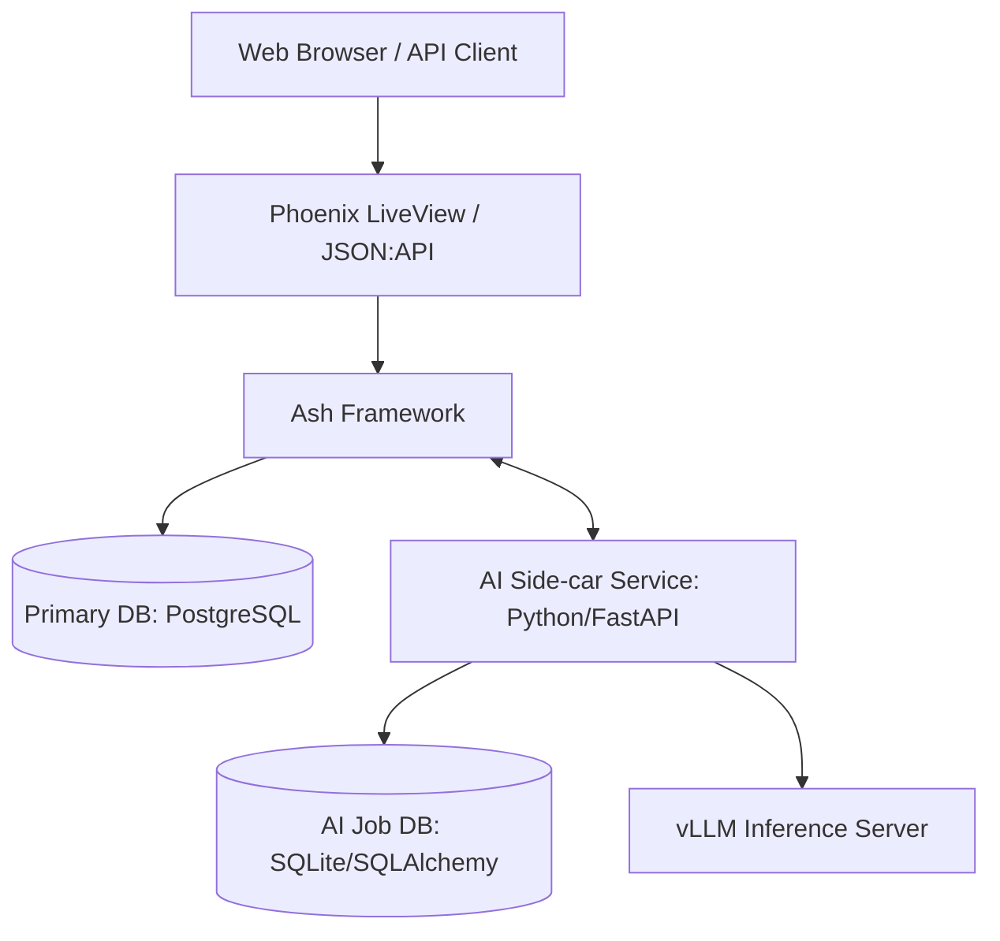

# System Architecture

This document describes the high-level architecture of the GroceryPlanner system.

## Overview

GroceryPlanner follows a **Side-car Microservice** architecture. The system is split into a core Elixir application for business logic and UI, and a specialized Python service for AI/ML capabilities.

## Components

### 1. Core Application (Elixir/Phoenix/Ash)
*   **Role**: Handles authentication, multi-tenancy, primary data persistence, UI rendering (LiveView), and external JSON:API.
*   **Framework**: Ash Framework is used for declarative resource management and business logic.
*   **Persistence**: PostgreSQL is the "Source of Truth" for all user and domain data.

### 2. AI Side-car Service (Python/FastAPI)
*   **Role**: Provides heavy-lift computational features (OCR, SMT Solving, Zero-shot Classification).
*   **Rationale**: Access to the mature Python ML ecosystem (SQLAlchemy, Z3, Transformers, PyTorch).
*   **Persistence**: Uses an isolated database (SQLite via SQLAlchemy) for job tracking, artifact storage, and feedback.

### 3. Inference Server (vLLM)
*   **Role**: Dedicated high-performance inference for Large Language Models (LLMs) used in OCR and Chat features.
*   **Infrastructure**: Usually runs on GPU-enabled hardware, separate from the application servers.
